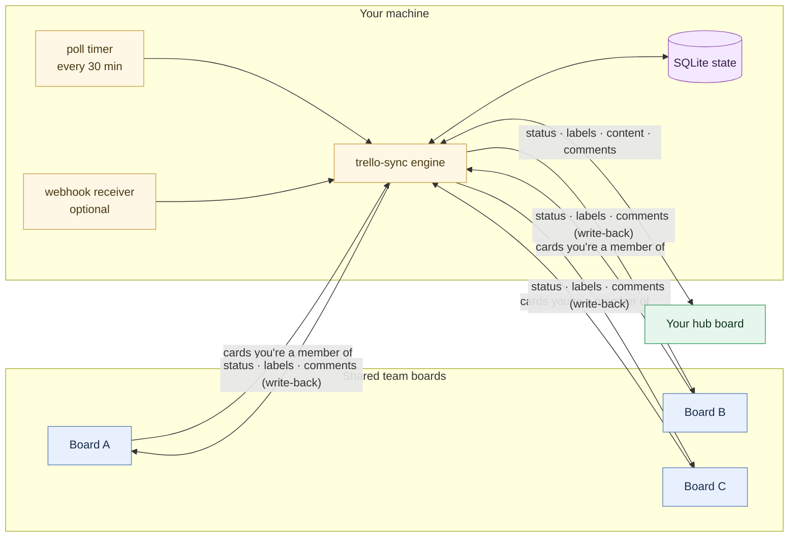

<div align="center">

# 🔁 Trello Hub Sync

**One personal Kanban for all your team boards — with real two-way sync.**

Aggregate every card *you own* across all your shared Trello boards onto a single personal "hub" board, manage it your way, and have **status, labels, descriptions, checklists, attachments and comments flow back** to the team boards automatically.

Self-hosted · zero dependencies · no SaaS · your data never leaves your machine.

[](LICENSE)


</div>

---

## The problem

You sit on five team boards. Your actual work is scattered across all of them, mixed in with everyone else's. There's no single place to see *just your stuff* and run it through *your own* workflow — and Trello's `me/cards` is read-only.

You could pay [Unito](https://unito.io) (~$60–150/mo, and your card data flows through their cloud), or use Trello's native [Mirror Cards](https://support.atlassian.com/trello/docs/mirroring-cards/) (paid plan, must be created by hand, and they **can't write a status column back** to the source). Neither gives you an *automatic*, *self-hosted*, *two-way* personal hub.

**Trello Hub Sync does.** Be a member of a card on any of your team boards → it appears on your hub board, in the right column, with its full content. Move it, label it, comment on it on *your* board → the original updates. All locally, for free.

## What it does

- 🧲 **Auto-aggregates by membership.** Any card you're a member of on a configured board is mirrored onto your hub board. No per-card setup. Stop being a member → the mirror archives itself.
- ↕️ **Two-way status, across different column schemes.** Your hub board's columns (`Backlog → Sprint → Dev → QA → Done` — whatever you like) are mapped to each team board's columns through a shared, canonical status. Move a card on either side and the other follows. **Conflicts: your hub board wins.**
- 🏷️ **Two-way labels.** Add an "URGENT" label on your hub card → it appears on the original. Remove it → it's removed. (Baseline-tracked, so removals propagate without loops.)
- 📄 **Full content on your board.** The source card's **description + checklists** are embedded in the mirror, and its **attachments are copied** (files re-uploaded so they open right there) — read everything without leaving your hub.
- 💬 **Two-way comments** (optional), with attribution and loop protection.
- 🧩 **"Dev column home"** (optional): cards in active development group in a `Dev` column until they reach a downstream column (QA/Done), then resume normal status sync.
- ⚡ **Real-time or polling.** A 30-minute safety poll out of the box; add an optional webhook receiver for near-instant sync.
- 🔒 **Local & private.** Pure Python standard library. State lives in a local SQLite file. Your only outbound calls are to Trello's own API.

## How it compares

| | **Trello Hub Sync** | Native Mirror Cards | Unito Board Sync | Butler |
|---|:---:|:---:|:---:|:---:|
| Auto-aggregate *my* cards by membership | ✅ | ❌ (manual, UI only) | ✅ (filter) | ❌ |
| Personal column scheme → write status **back** | ✅ | ❌ | ✅ | ⚠️ loop-prone |
| Two-way labels | ✅ | ✅ | ✅ | ❌ one-way |
| Description / checklists / attachments | ✅ | ✅ | ✅ | partial |
| Two-way comments | ✅ | ✅ | ✅ | ❌ |
| Self-hosted / data stays local | ✅ | n/a (SaaS) | ❌ | n/a |
| Cost | **free** | paid plan | ~$60–150/mo | included |

> Honest note: the *concept* of two-way multi-board sync isn't new — Unito sells it. What's unusual here is doing **membership-driven aggregation + personal-column write-back, fully self-hosted and free**, with the niceties (Dev-home, content/attachment/comment mirroring, self-healing webhooks) built in.

## Architecture



The engine is **stateless and idempotent**: every run re-derives the truth from Trello's API and reconciles. Run it from a timer, a webhook, or by hand — as often as you like. A file lock serializes overlapping runs.

## Quick start

**1. Install** (Python 3.11+, no dependencies):

```bash
git clone https://github.com/nabbilkhan/trello-hub-sync
cd trello-hub-sync
pip install .          # gives you the `trello-sync` command
```

**2. Get credentials** from the [Trello Power-Up admin](https://trello.com/power-ups/admin) (an API **key**) and generate a **token** for your account.

**3. Discover your IDs** (the painful part, made easy):

```bash
export TRELLO_HUB_KEY=...   TRELLO_HUB_TOKEN=...
trello-sync discover                 # your member id + every board id
trello-sync discover --board <id>    # a board's list + label ids
```

**4. Configure:**

```bash
mkdir -p ~/.config/trello-hub-sync
cp config.example.toml ~/.config/trello-hub-sync/config.toml
$EDITOR ~/.config/trello-hub-sync/config.toml   # paste the ids from step 3
```

**5. Dry-run, then go live:**

```bash
trello-sync sync --dry-run     # shows exactly what it WOULD do, changes nothing
trello-sync sync               # do it
```

**6. Schedule it** (Linux/systemd user units):

```bash
cp systemd/trello-sync.{service,timer} ~/.config/systemd/user/
systemctl --user daemon-reload
systemctl --user enable --now trello-sync.timer   # every 30 minutes
```

…or just add `trello-sync sync` to `cron`. That's it.

### Optional: real-time

Want instant sync instead of every 30 min? Run the receiver behind any HTTPS reverse proxy or tunnel and register webhooks — see [docs/WEBHOOKS.md](docs/WEBHOOKS.md). The poll timer stays as a safety net.

## How the clever bits work

- **Status mapping.** Column names on every board reduce to a canonical status (`backlog, sprint, in_progress, qa, discussion, hold, done`). "Requires QA ☑️", "QA/Test", "Done 🎉" all map cleanly. Hub-only columns with no shared meaning (e.g. "Resources") are **parked** — left untouched, never pushed.
- **Conflict resolution.** Each mirror remembers its *last-synced* status. If only one side moved, the other follows; if both moved, **your hub board wins**. (See [docs/ARCHITECTURE.md](docs/ARCHITECTURE.md).)
- **Label removals without loops.** A per-card *baseline* of synced label names lets the engine tell "you deliberately removed this" from "this was never synced," so removals propagate exactly once.
- **No description churn.** Machine state lives in SQLite, not in card descriptions. The description carries only your content + a tiny stable marker, and is rewritten **only when the content hash changes**.

## State, safety & recovery

- All state is one SQLite file (`~/.local/state/trello-hub-sync/state.db`). Delete it and `trello-sync backfill` rebuilds it from the card markers.
- A lost state DB never causes data loss: unknown baselines are treated as "additions only," never spurious removals.
- A `flock` serializes concurrent runs (poll + webhook) so nothing is duplicated.
- `--dry-run` previews every action. The engine only ever *reconciles* — it doesn't trust webhook payloads.

## Security & privacy

- **Standard library only** — nothing but Python and your Trello token. Audit it in an afternoon.
- Your token and (optional) webhook secret can live in separate files, not in the config.
- The webhook receiver verifies Trello's HMAC signature and listens only on localhost; you choose how to expose it.
- No telemetry, no third-party service, no card data leaves your machine except to Trello itself.

## FAQ

**Does it need a paid Trello plan?** No. Works on free Trello (unlike native Mirror Cards).

**Will it mess up my team boards?** It only moves a card's list, adds/removes labels, and posts comments — all reversible, all things you could do by hand. `--dry-run` shows everything first.

**Multiple people?** It's built for one person aggregating *their* cards. Each person runs their own copy with their own hub board and token.

**What if two of us edit the same card?** Source-side edits flow to your hub; your hub-side moves win on conflict (by design — your board is your control surface).

**Windows / macOS?** The engine is cross-platform Python. The systemd units and example watchdog are Linux; use Task Scheduler / `launchd` / `cron` elsewhere.

## Contributing

Issues and PRs welcome — see [CONTRIBUTING.md](CONTRIBUTING.md). Security reports: [SECURITY.md](SECURITY.md).

## License

[MIT](LICENSE) © Nabbil Khan. Built and battle-tested in production syncing a personal hub board against four shared executive boards.
